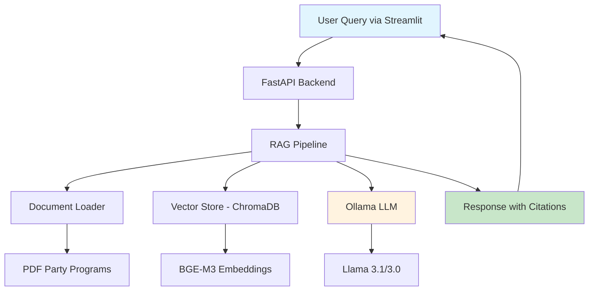

# Misinformation and Disinformation Detection in German Politics

## Machine Learning RAG Pipeline with Motivational Interviewing

A Retrieval-Augmented Generation (RAG) system designed to combat misinformation about German political parties by providing factual, sourced responses from official party programs using a Motivational Interviewing conversational style.

---

## Table of Contents

- [Overview](#overview)
- [Features](#features)
- [Architecture](#architecture)
- [Installation](#installation)
- [Quick Start](#quick-start)
- [Usage](#usage)
- [API Documentation](#api-documentation)
- [Configuration](#configuration)
- [Screenshots](#screenshots)
- [Development](#development)
- [Deployment](#deployment)
- [Contributing](#contributing)
- [Wiki](#wiki)
- [License](#license)

---

## Overview

This project addresses the spread of political misinformation on social media platforms (TikTok, Instagram, YouTube) by providing an AI-powered fact-checking system. Users can input claims they've seen online and receive accurate, sourced information from official German party programs.

### Key Technologies

- **LLM**: Llama 3.1:8b (development) / Llama 3:70b (production)
- **Embedding Model**: BGE-M3 (optimized for German language)
- **Framework**: LangChain + FastAPI + Streamlit
- **Vector Store**: ChromaDB with cosine similarity
- **Orchestration**: Docker Compose (production)
- **Cache**: Redis (planned)

---

## Features

-  **Intelligent Retrieval**: Searches through official party programs (CDU, SPD, Grüne, AfD, FDP, Die Linke)
- **Source Citations**: Every response includes PDF source and page numbers
- **Motivational Interviewing**: Empathetic, non-confrontational conversation style
- **Chunk Visibility**: Shows the exact text chunks used for answer generation
- **Conversation Memory**: Maintains context for up to 5 exchanges
- **German-Optimized**: BGE-M3 embeddings for superior German language understanding
- **Relevance Scoring**: Displays confidence scores for retrieved information

---

## Architecture



### Component Overview

1. **Frontend**: Streamlit web interface with chat functionality
2. **API Layer**: FastAPI microservice handling requests
3. **RAG Pipeline**: Document retrieval and response generation
4. **Vector Store**: ChromaDB for semantic search
5. **LLM Service**: Ollama serving Llama models locally

---

## Installation

### Prerequisites

- Python 3.11+
- Ollama installed and running
- 16GB+ RAM (for 8b model)


### Step 1: Clone Repository

```bash
git clone https://github.com/yourusername/langchain-rag-practical.git
cd langchain-rag-practical
```

### Step 2: Create Virtual Environment

```bash
python -m venv venv
source venv/bin/activate  # On Windows: venv\Scripts\activate
```

### Step 3: Install Dependencies

```bash
pip install -r requirements.txt
```

### Step 4: Install Ollama Models

```bash
# Install the LLM
ollama pull llama3.1:8b

# Install the embedding model
ollama pull bge-m3
```

### Step 5: Prepare Documents

Place your PDF files in `documents/sources/`. The system currently includes:
- `AfD_Bundestagswahlprogramm2025.pdf`
- `fdp-wahlprogramm_2025.pdf`
- `Koalitionsvertrag---barrierefrei.pdf`
- `Parteiprogramm_Die_Linke_2024.pdf`
- `Regierungsprogramm.pdf`
- `20250205_Regierungsprogramm_final.pdf`

---

## 🚀 Quick Start

### 1. Generate Embeddings (First Time Only)

```bash
python app/embed_documents.py
```

This creates vector embeddings for all PDFs and stores them in `embeddings/chromadb/`.

### 2. Start the API Server

```bash
uvicorn app.main:app --reload --port 8000
```

### 3. Launch Streamlit Interface

```bash
streamlit run ui/UserInterface.py
```

### 4. Access the Application

Open your browser and navigate to: `http://localhost:8501`

---

## 💡 Usage

### Basic Workflow

1. **Enter a claim**: Type a political claim you've seen on social media
2. **Get verified response**: The AI analyzes official documents and provides facts
3. **Review sources**: Check the retrieved chunks and page numbers
4. **Continue conversation**: Ask follow-up questions with maintained context

### Example Queries

```text
"Ich habe gelesen, die CDU will alle Sozialleistungen kürzen. Stimmt das?"

"Auf TikTok wird behauptet, die SPD will alle Steuern drastisch erhöhen. Können Sie das bestätigen?"

"Jemand hat mir erzählt, die Grünen wollen Fleisch komplett verbieten. Was sagen die wirklich?"
```

### Response Features

Each response includes:
- ✅ Fact-checked answer in Motivational Interviewing style
- 📄 Source citations with PDF names and page numbers
- 🔍 Retrieved text chunks with relevance scores
- 💬 Maintained conversation context

---

## 📡 API Documentation

### Endpoints

#### `POST /generate`
Generate a RAG response for a user query.

**Request:**
```json
{
  "session_id": "uuid-string",
  "query": "User's question in German"
}
```

**Response:**
```json
{
  "response": "AI-generated answer with citations",
  "chunks": [
    {
      "chunk_id": 1,
      "score": 0.89,
      "source": "AfD_Bundestagswahlprogramm2025.pdf",
      "page": 42,
      "content": "First 300 characters of chunk..."
    }
  ],
  "history": [...]
}
```

#### `POST /reset`
Clear conversation history for a session.

#### `GET /health`
Health check endpoint returning active sessions.

---

## ⚙️ Configuration

### RAG Pipeline Settings (`app/rag_pipeline.py`)

```python
# Model Configuration
EMBED_MODEL = "bge-m3"        # German-optimized embeddings
CHAT_MODEL = "llama3.1:8b"    # Or "llama3:70b" for production

# Chunking Parameters
CHUNK_SIZE = 800              # Characters per chunk
CHUNK_OVERLAP = 120           # Overlap between chunks

# Retrieval Settings
RETRIEVE_K = 4                # Number of chunks to retrieve
MEMORY_EXCHANGES = 5          # Number of Q&A pairs to remember
```

### System Prompt

The Motivational Interviewing style is configured in `app/system_prompt.md`. Modify this file to adjust the conversation style.

---

## 📸 Screenshots

### Main Chat Interface

*The main conversation view with user queries and AI responses*

### Retrieved Chunks Display

*Showing the 4 retrieved chunks with scores and page numbers*

### Source Citations

*In-text citations with PDF sources and page numbers*


## 🔧 Development

### Project Structure

```
langchain-rag-practical/
├── app/
│   ├── __init__.py
│   ├── main.py                 # FastAPI application
│   ├── endpoints.py             # API endpoints
│   ├── rag_pipeline.py         # Core RAG logic
│   ├── ollama_client.py        # LLM interface
│   ├── pdf_loader.py           # Document loading
│   ├── embed_documents.py      # Embedding generation
│   ├── utils.py                # Utility functions
│   └── system_prompt.md        # MI conversation style
├── ui/
│   └── UserInterface.py        # Streamlit frontend
├── documents/
│   └── sources/                # PDF storage
├── embeddings/
│   └── chromadb/               # Vector store
├── notebooks/                  # Development notebooks
├── requirements.txt
├── docker-compose.yml
├── Dockerfile.api
├── Dockerfile.streamlit
└── README.md
```

### Testing

```bash
# Run tests (to be implemented)
pytest tests/

# Check code quality
black app/
pylint app/
```


---

## 🐳 Deployment

### Docker Deployment (Production)

For production deployment with Llama 3:70b on GPU-enabled servers:

```bash
# Build and start all services
docker-compose up --build -d

# Check logs
docker-compose logs -f

# Stop services
docker-compose down
```

### Environment Variables

```bash
# API Configuration
OLLAMA_HOST=http://localhost:11434
RAG_API_URL=http://localhost:8000

# Model Selection
CHAT_MODEL=llama3:70b  # For production
MEMORY_EXCHANGES=8      # Increase for 70b model
```

---


## Wiki

For detailed documentation, visit our [GitHub Wiki](../../wiki):

- [Architecture Deep Dive](../../wiki/Architecture)
- [Motivational Interviewing Guide](../../wiki/Motivational-Interviewing)
- [API Reference](../../wiki/API-Reference)
- [Troubleshooting](../../wiki/Troubleshooting)
- [Performance Tuning](../../wiki/Performance-Tuning)
- [Adding New Documents](../../wiki/Adding-Documents)

---

## License

This project is licensed under the MIT License - see the [LICENSE](LICENSE) file for details.

---

##  Acknowledgments

- **Supervisor**: Omed Abed

---

##  Contact

- **Author**: Brian Llane
- **Email**: Brian.Llane@hsrw.org
- **Institution**: Rhine-Waal University of Applied Sciences

---


*Last Updated: August 2025*